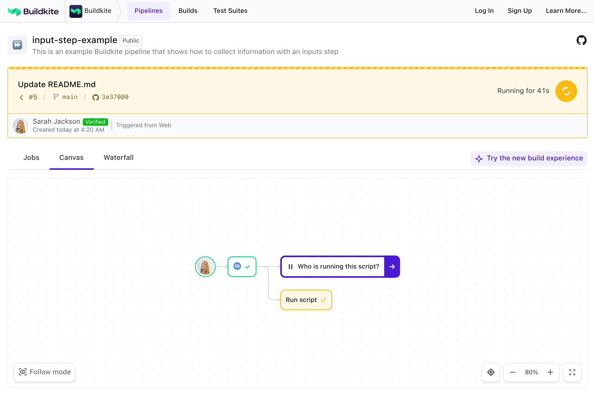
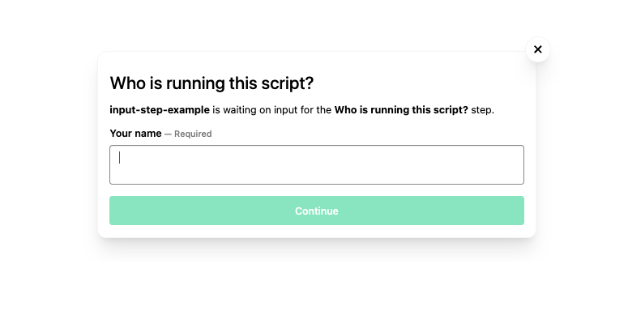
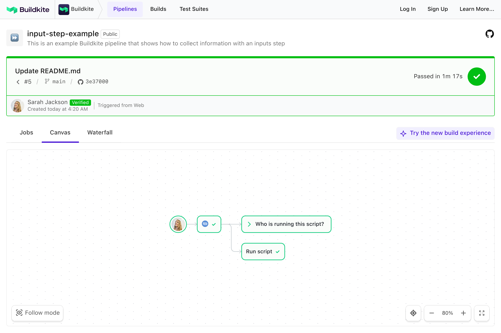
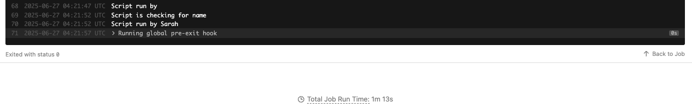

# Buildkite Input Step Example

This repository is an example [Buildkite](https://buildkite.com/) pipeline that demonstrates how to use an [Input Step](https://buildkite.com/docs/pipelines/configure/step-types/input-step) to pause a build and request manual input.

👉 **See this example in action:** [https://buildkite.com/docs/pipelines/input-step-example](https://buildkite.com/buildkite/input-step-example/builds/latest)

See the full [Getting Started Guide](https://buildkite.com/docs/guides/getting-started) for step-by-step instructions on how to get this running, or try it yourself:

  
   
  <em>The pipeline paused at an input step</em>

  
   
  <em>The input dialog prompting for a value</em>

  
   
  <em>The pipeline resuming after the input is submitted</em>

  
   
  <em>The input value echoed back by the script</em>

<!-- docs:start -->

## How it works

This example:
- Uses an [Input Step](https://buildkite.com/docs/pipelines/input-step) to ask for a value mid-pipeline.
- Passes that value to a script (choose from [`script.sh`](script.sh) or [`script.ps1`](script.ps1)) that echoes it back.
- Can be extended to support manual approvals, environment switching, or conditional builds.

To switch platforms, edit the step in `.buildkite/pipeline.yml`.

<!-- docs:end -->

## License

See [Licence.md](Licence.md) (MIT)
